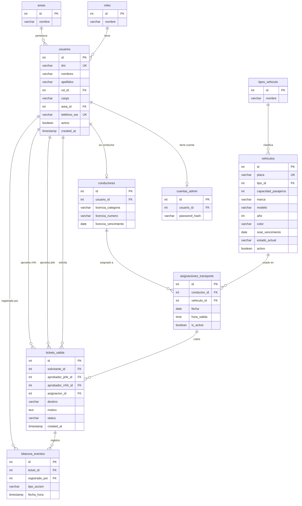

# Diagrama de Base de Datos — GatePass

---

## Notas importantes

### Roles — datos semilla, sin POST público
Los roles viajan con la DB al arrancar. No hay endpoint para crearlos desde fuera.

| ID | Rol |
|----|-----|
| 1 | superadmin |
| 2 | rrhh |
| 3 | jefe_area |
| 4 | conductor |
| 5 | vigilante |

### `status` en tickets_salida
Valores permitidos:

| Estado | Descripción |
|--------|-------------|
| `pendiente` | Recién creado, esperando jefe |
| `aprobado_jefe` | Jefe aprobó, esperando RRHH |
| `aprobado_rrhh` | Completamente aprobado |
| `rechazado` | Rechazado en cualquier etapa |
| `activo` | Empleado ya salió |
| `cerrado` | Retornó |

### `tipo_accion` en bitacora_eventos
Valores permitidos:

| Acción | Quién la registra |
|--------|------------------|
| `salida_garita` | Vigilante |
| `retorno_garita` | Vigilante |
| `abordaje_vehiculo` | Conductor |

### `soat_vencimiento` en vehiculos
Campo crítico — n8n revisa este campo y dispara alerta por WhatsApp cuando faltan 30 días para el vencimiento.
